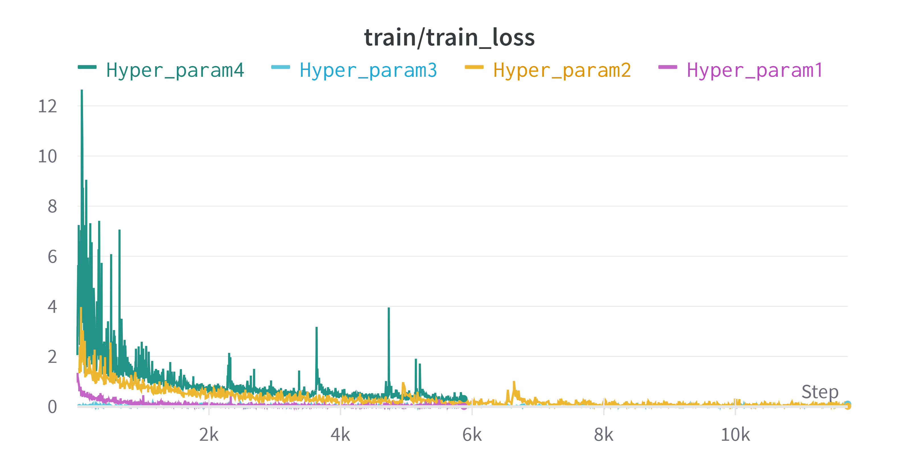
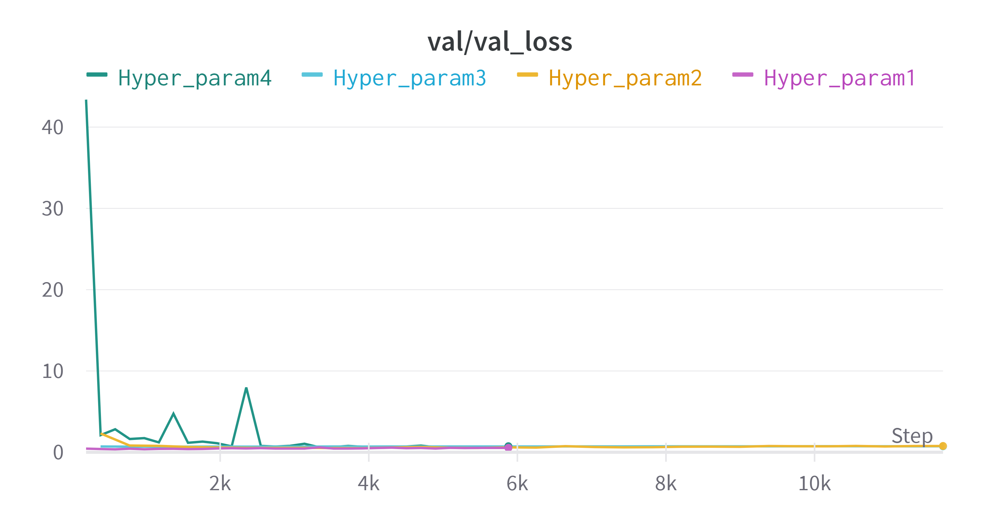
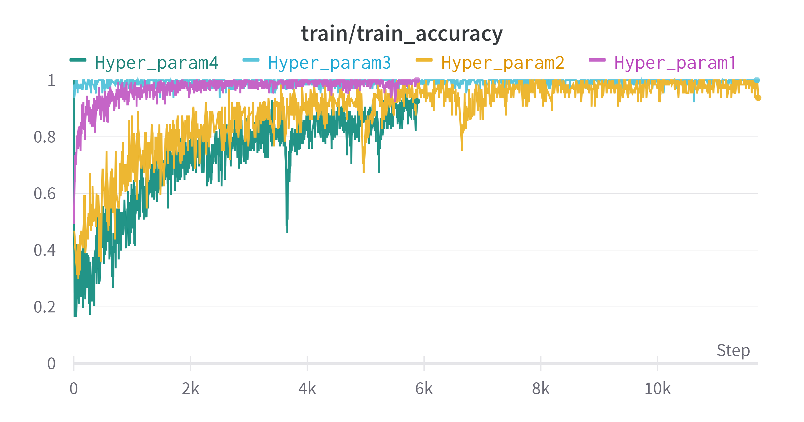
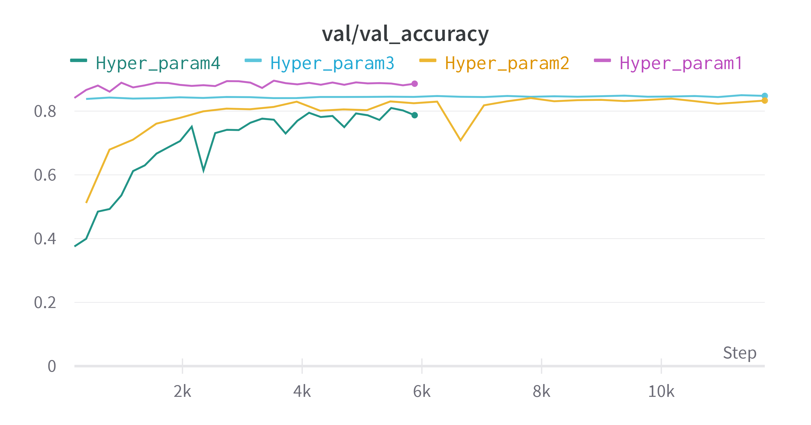
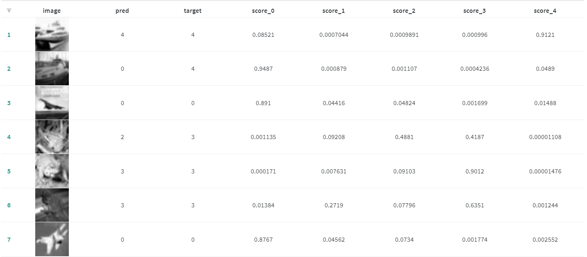

# PART 1: Training a ResNet18 Model for Classification on Even Classes of CIFAR-10 using Weights and Biases (Wandb) in Colab

## Monitoring Training Progress with Weights and Biases (Wandb)

In this project, WANDB is used for monitoring and visualizing the training progress of machine learning model.

### Validation Loss

Here's a visualization of loss and accuracy during training, generated using Wandb:

## Performance

<table>
  <tr>
    <td>
      
    </td>
    <td>
      
    </td>
  </tr>
</table>

<table>
  <tr>
    <td>
      
    </td>
    <td>
      
    </td>
  </tr>
</table>

## Imagewise prediction:



This repository contains a Colab notebook that allows you to train a ResNet18 model for image classification on the even classes of CIFAR-10 using the Weights and Biases (Wandb) framework. You can easily run this notebook in Colab without the need to set up any dependencies on your local machine.


## Usage Instructions

1. Open Google Colab:

   Open Google Colab by visiting [https://colab.research.google.com/](https://colab.research.google.com/).

2. Clone the Repository:

   In a code cell in your Colab notebook, use the following command to clone this repository directly to your Colab environment:

   ```python
   !git clone https://github.com/AvantiVarude/resnet18_hyperparam_wandb.git
   ```

3. Open the Colab Notebook:

   Navigate to the `resnet18_hyperparam_wandb` directory that you just cloned and open the provided Colab notebook.

4. Set up Your Wandb Account:

   If you haven't already, sign up for a Weights and Biases (Wandb) account at [https://wandb.ai/](https://wandb.ai/).

5. Authenticate Your Wandb Account:

   In the Colab notebook, you will find instructions on how to authenticate your Wandb account using the provided code snippet. Follow these instructions to log in to your Wandb account.

6. Run the Notebook:

   Execute the cells in the Colab notebook one by one to train the ResNet18 model. The notebook contains code for loading the CIFAR-10 dataset, configuring hyperparameters, training the model, and logging results with Wandb.

7. Monitoring and Visualizing Results:

   You can monitor and visualize the training progress, metrics, and other information on the Wandb dashboard, as it will be integrated directly within the notebook.

8. Experimentation:

   To experiment with different hyperparameters, you can modify the values directly in the notebook and re-run the training cells. Wandb will keep track of all your experiments and their results for easy comparison.


## PART 2: Hyperparameter Optimization with Optuna

1. **Run the Notebook**:
   Execute the cells in the Colab notebook one by one. The notebook contains code for loading the MNIST dataset, configuring hyperparameters, training the model, and logging results with the script will log the hyperparameters it explores, as well as the corresponding performance metrics. You can analyze these results to determine the best hyperparameter configuration for a model.
   
2. **Customization**:
   Feel free to customize the optimization objective, search space, and other parameters in the "optuna_file.py" script to suit your specific requirements.

## Conclusion

This README provides instructions for running the provided Colab notebook to train a ResNet18 model for image classification on even classes of CIFAR-10 using Weights and Biases (Wandb). You can easily run and experiment with different hyperparameters directly in Colab without the need to set up dependencies locally. Optuna is efficient in selecting hyperparameters and also prunes (removes) parameter sets that are unlikely to produce good results, saving time and resources in the optimization process.

Using Optuna, we can efficiently search for the best hyperparameters to improve our model's performance, making model experiments more effective and less time-consuming.


You can play with different hyperparameters, datasets and models.

References:
1. https://wandb.ai/
2. https://github.com/elena-ecn/optuna-optimization-for-PyTorch-CNN/blob/main/optuna_optimization.py
